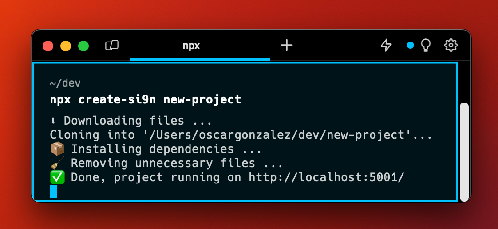

<div align="center">

[![Contributors][contributors-shield]][contributors-url]
[![Issues][issues-shield]][issues-url]

</div>
<br />

<!-- ABOUT THE PROJECT -->

# Create Si9n


<p>create-si9n is a NodeJS script that initializes a new message template for si9n.</p>


<!-- GETTING STARTED -->

## Getting Started

To create a new si9n template just run the following command on your cli:

   ```sh
   npx create-si9n project-name
   ```


## Author

[www.oscargonzalez.dev](https://oscargonzalez.dev) |
[LinkedIn](https://linkedin.com/in/oscargonzalezdev) |
[Twitter](https://twitter.com/oscardev_)


## Links

- [NPM](https://www.npmjs.com/package/create-si9n)
- [Report Bug](https://github.com/oscargonzalezdev/create-si9n/issues/new)
- [Support](https://www.buymeacoffee.com/oscardev)

<p align="right">(<a href="#readme-top">back to top</a>)</p>

<!-- MARKDOWN LINKS & IMAGES -->
<!-- https://www.markdownguide.org/basic-syntax/#reference-style-links -->

[contributors-shield]: https://img.shields.io/github/contributors/oscargonzalezdev/create-si9n.svg?style=for-the-badge
[contributors-url]: https://github.com/oscargonzalezdev/create-si9n/graphs/contributors
[forks-shield]: https://img.shields.io/github/forks/oscargonzalezdev/create-si9n.svg?style=for-the-badge
[forks-url]: https://github.com/oscargonzalezdev/create-si9n/network/members
[stars-shield]: https://img.shields.io/github/stars/oscargonzalezdev/create-si9n.svg?style=for-the-badge
[stars-url]: https://github.com/oscargonzalezdev/create-si9n/stargazers
[issues-shield]: https://img.shields.io/github/issues/oscargonzalezdev/create-si9n.svg?style=for-the-badge
[issues-url]: https://github.com/oscargonzalezdev/create-si9n/issues
